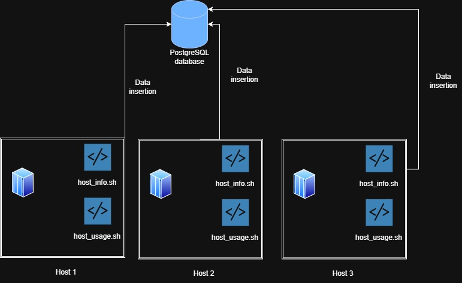

# <ins> Linux Cluster Monitoring agent<ins>

# Introduction
The Jarvis Cluster Administration (LCA) team manages a Linux cluster composed of 10 nodes interconnected through a switch. The team wants to be able to retrieve the hardware specifications of each node and monitor their resource usage, such as memory and CPU, in real time. To achieve this, monitoring agent scripts (host_info.sh and host_usage.sh) are developed to gather hardware details and resource usage. The host_usage.sh script is scheduled with cron to run at regular intervals to gather resource usage. All collected data is stored in a relational database, PostgreSQL, which is provisioned and managed using Docker. The projects source code is managed with Git and hosted on GitHub, enabling version control.

# Quick Start
- Start a psql instance using psql_docker.sh
```
./scripts/psql_docker.sh start
```
- Create tables using ddl.sql
```
psql -h localhost -U postgres -d host_agent -f sql/ddl.sql
```
- Insert hardware specs data into the DB using host_info.sh
```
  ./scripts/host_info.sh "localhost" 5432 "host_agent" "postgres" "password"
```
- Insert hardware usage data into the DB using host_usage.sh
```
./scripts/host_usage.sh "localhost" 5432 "host_agent" "postgres" "password"
```
- Crontab setup
```
# edit crontab jobs
bash> crontab -e

# add this to crontab
# make sure you are using the correct file location for your script
* * * * * bash /home/centos/dev/jrvs/bootcamp/linux_sql/host_agent/scripts/host_usage.sh localhost 5432 host_agent postgres password > /tmp/host_usage.log
```
# Implemenation

The project is implemented as a **Minimum Viable Product (MVP)** to help the LCA team collect and analyze hardware and resource usage data from the Linux cluster. A **PostgreSQL** database is provisioned using **Docker**. The database schema includes tables for host hardware specifications and resource usage metrics.

#### Monitoring Agent Scripts

Two **Bash scripts** are developed to gather data from each node:

- **`host_info.sh`** collects static hardware information about hardware and inserts it into the database. This script is run only once during setup.

- **`host_usage.sh`** collects dynamic resource usage (CPU and memory) and inserts it into the database periodically. This script is scheduled with **cron** to run at regular intervals (every minute).

## Architecture


## Scripts
- psql_docker.sh

This Bash script manages a PostgreSQL Docker container for development. It allows you to **create**, **start**, or **stop** the container.
```
# Create a new PostgreSQL container with username and password
./scripts/psql_docker.sh create <db_username> <db_password>

# Start the PostgreSQL container
./scripts/psql_docker.sh start

# Stop the PostgreSQL container
./scripts/psql_docker.sh stop
```

- host_info.sh

This Bash script collects **hardware specification data** from a Linux host and inserts it into the PostgreSQL database. Since hardware specifications are static, the script is intended to be run **only once** .
```
./scripts/host_info.sh "localhost" 5432 "host_agent" "postgres" "password"
```
  
- host_usage.sh

This Bash script collects **dynamic server usage data** from a Linux host, such as CPU and memory utilization, and inserts it into the PostgreSQL database. The script is designed to run **periodically every minute** using Linux's **cron** scheduler.
```
./scripts/host_usage.sh "localhost" 5432 "host_agent" "postgres" "password"
```

- crontab

This setup uses **Linux's crontab** to automatically execute the `host_usage.sh` script every minute.
```
# edit crontab jobs
bash> crontab -e

# add this to crontab
# make sure you are using the correct file location for your script
* * * * * bash /home/centos/dev/jrvs/bootcamp/linux_sql/host_agent/scripts/host_usage.sh localhost 5432 host_agent postgres password > /tmp/host_usage.log
```
- queries.sql 

To verify the database data using psql CLI using this command for the host_usage table for example:
```
SELECT * FROM host_usage;
```
## Database Modeling

- `host_info`

| Column Name      | Data Type  | Nullable | Description                          |
|-----------------|-----------|---------|--------------------------------------|
| id              | SERIAL    | No      | Primary key, unique identifier for each host |
| hostname        | VARCHAR   | No      | Hostname of the machine              |
| cpu_number      | INT2      | No      | Number of CPU cores                   |
| cpu_architecture| VARCHAR   | No      | CPU architecture                      |
| cpu_model       | VARCHAR   | No      | Model name of the CPU                 |
| cpu_mhz         | FLOAT8    | No      | CPU clock speed in MHz                 |
| l2_cache        | INT4      | No      | L2 cache size in KB                    |
| timestamp       | TIMESTAMP | Yes     | Timestamp in UTC                       |
| total_mem       | INT4      | Yes     | Total memory in KB                     |


- `host_usage`

| Column Name     | Data Type  | Nullable | Description / Notes                                  |
|-----------------|-----------|---------|------------------------------------------------------|
| timestamp       | TIMESTAMP | No      | UTC timestamp when the usage data was recorded      |
| host_id         | SERIAL    | No      | Foreign key referencing `host_info(id)`             |
| memory_free     | INT4      | No      | Free memory on the host, in MB                       |
| cpu_idle        | INT2      | No      | CPU idle percentage                                  |
| cpu_kernel      | INT2      | No      | CPU usage by kernel, in percentage                  |
| disk_io         | INT4      | No      | Number of disk I/O operations                        |
| disk_available  | INT4      | No      | Available disk space on root directory, in MB       |


# Test

- **DDL (`ddl.sql`)**: I tested both cases when the tables already exist and when they do not and confirmed the results in the `psql` CLI using `\dt`.

- **`host_info.sh`**: Run the script once on a host and verified that hardware data was correctly inserted into the `host_info` table.

- **`host_usage.sh`**: Run the script manually and checked that usage data was inserted into the `host_usage` table using `SELECT` queries.

# Deployment
The project is deployed using **GitHub** for version control, **Docker** to run the PostgreSQL database, and **cron** to schedule the `host_usage.sh` script to collect data automatically at regular intervals.

# Improvements

-  Handle hardware updates dynamically in `host_info.sh`.
- Add a primary key to the `host_usage` table for better data integrity and easier referencing.
- Test the scripts and database insertion with multiple nodes to ensure scalability.